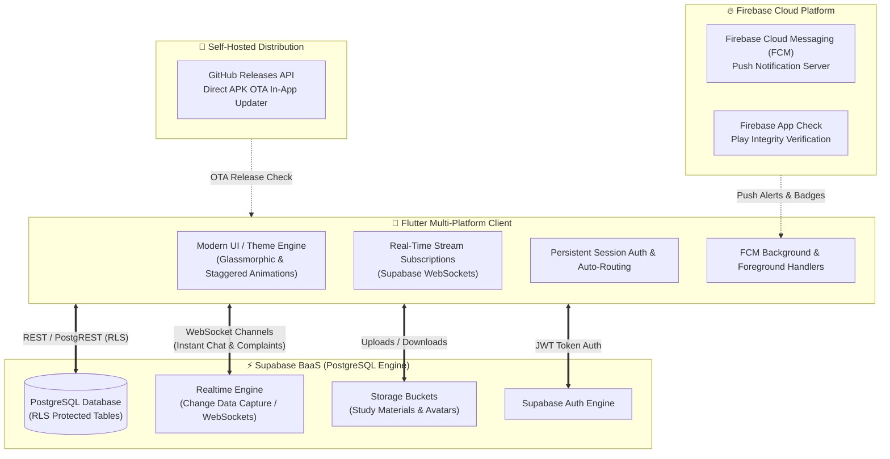
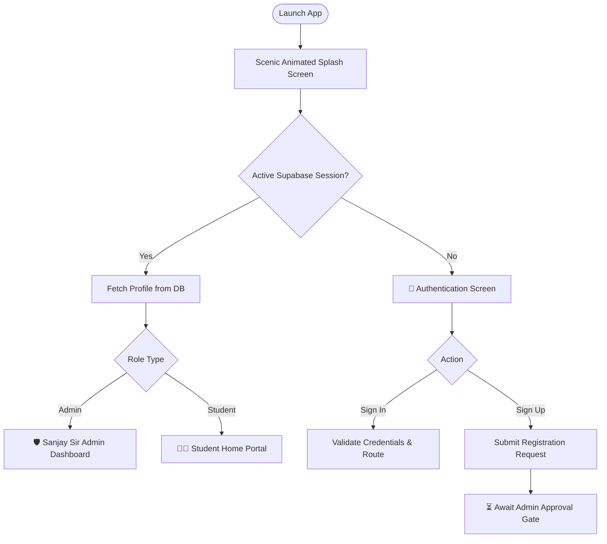
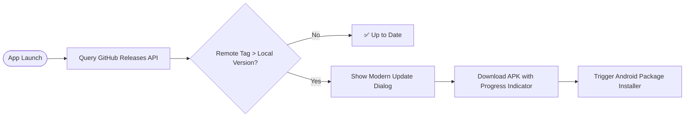

<div align="center">

  

  # 🎓 Darvesh Classes
  ### *Empowering Excellence in Education*

  [](https://flutter.dev)
  [](https://dart.dev)
  [](https://supabase.com)
  [](https://firebase.google.com)
  [](https://developer.android.com)
  [](LICENSE)

  <p align="center">
    <strong>A Next-Generation, Real-Time Educational Management & Communication Ecosystem built with Flutter and Supabase.</strong>
  </p>

  <p align="center">
    <a href="#-key-features">Key Features</a> •
    <a href="#-system-architecture">System Architecture</a> •
    <a href="#-interactive-workflows">Workflows</a> •
    <a href="#-tech-stack">Tech Stack</a> •
    <a href="#-getting-started">Getting Started</a> •
    <a href="#-in-app-updates">OTA Updates</a>
  </p>

</div>

---

## 🌟 Overview

**Darvesh Classes** is a modern, cross-platform academy management platform tailored for premier coaching institutes. Built from the ground up to replace outdated polling architectures, it delivers a **WhatsApp-grade real-time experience** for student-teacher communication, attendance tracking, study material distribution, and administrative operations.

---

## 🚀 Key Features

### 👨‍🎓 For Students
* **⚡ Instant 1-on-1 Chat with Sanjay Sir:** Zero-latency private messaging with realtime read receipts and WebSocket streams.
* **📢 Realtime Announcements Feed:** Class-specific notifications, urgent circulars, and broadcast news.
* **📊 Visual Attendance Tracker:** Monthly attendance breakdown, present/absent trends, and interactive calendar views.
* **📚 Digital Study Material Hub:** Cloud storage integration to view, download, and read syllabus notes, assignments, and PDFs.
* **🎫 Grievance & Complaint Desk:** Submit private queries or complaints and track realtime status resolution.
* **✨ Smooth Glassmorphic UI:** Built with modern design tokens, 120fps physics animations, and custom typography.

### 🛡️ For Administrator (Sanjay Sir)
* **📬 Unified Realtime Inbox:** Centralized chat console to message individual students or broadcast to entire standards.
* **🔐 Student Verification Gate:** Review, approve, or reject student registration requests before granting database access.
* **📅 Smart Attendance Register:** Instant batch attendance marking with automatic notification dispatch to parents/students.
* **📤 Resource Publisher:** Upload PDFs, notes, and study material categorized by Standard (5th–10th) with auto-push notification alerts.
* **👥 Batch Migration & Management:** Automatic end-of-year standard promotions and batch cleanup tools.
* **🔄 Self-Hosted OTA In-App Updater:** Direct APK updates delivered directly to users from GitHub Releases without Google Play Store.

---

## 🏗️ System Architecture



---

## 🔄 Interactive Workflows

### 1. WhatsApp-Grade Realtime Chat Flow
```mermaid
sequenceDiagram
    autonumber
    actor Student as 👨‍🎓 Student
    participant App as 📱 Flutter Client
    participant Supabase as ⚡ Supabase Realtime
    actor Admin as 👨‍🏫 Sanjay Sir (Admin)

    Student->>App: Types & sends message
    App->>Supabase: INSERT into messages table
    Supabase-->>Supabase: Evaluate Row Level Security (RLS)
    Supabase->>>Admin: Broadcast over WebSocket (0ms delay)
    Admin->>Supabase: Reads message & replies
    Supabase->>>Student: Realtime WebSocket Push update
    Student-->>App: UI renders bubble with smooth bounce
```

---

### 2. Student Authentication & Session Lifecycle


---

### 3. In-App OTA Auto-Updater Flow


---

## 💻 Tech Stack & Engineering Highlights

| Layer | Technologies Used | Purpose |
| :--- | :--- | :--- |
| **Frontend Framework** | **Flutter 3.x / Dart 3.x** | High-performance, 120fps cross-platform client |
| **Typography & Styling** | **Google Fonts (Outfit)** | Modern educational typography & glassmorphic theme |
| **Backend & Realtime** | **Supabase (PostgreSQL 15+)** | Realtime WebSockets, Row Level Security, Storage Buckets |
| **Push Notifications** | **Firebase Cloud Messaging (FCM)** | Background device push notifications |
| **Security & Integrity** | **Firebase App Check (Play Integrity)** | Prevents unauthorized API abuse & spoofing |
| **File Storage** | **Supabase Storage** | High-speed CDN for PDF notes, syllabus files & avatars |
| **Android Toolchain** | **AGP 8.7.3, Kotlin 2.1.10, NDK 27, Java 17** | Modern Android Gradle pipeline with R8 minification |

---

## 📂 Project Structure

```plaintext
lib/
├── main.dart                  # App bootstrap, Firebase/Supabase initialization & root router
├── splash_screen.dart         # Ultra-premium animated splash screen with particle canvas
├── authentication_page.dart   # Secure sign-in & password recovery
├── sign_up_page.dart          # Student registration with standard selection
├── home_page.dart             # Student dashboard & navigation hub
├── admin_page.dart            # Sanjay Sir command center & admin controls
├── student_chat_page.dart     # Realtime 1-on-1 WebSocket chat interface
├── message_to_students.dart   # Broadcast announcements feed with class filters
├── view_messages_page.dart    # Admin unified inbox overview
├── mark_attendance.dart       # Batch attendance register
├── show_attendance.dart       # Student visual attendance analytics & calendar
├── update_study_material.dart # Admin study material uploader & manager
├── study_material.dart        # Student PDF viewer & download hub
├── complain_page.dart         # Student grievance submission desk
├── send_complains_admin.dart  # Admin complaint resolution dashboard
├── verify_student_requests.dart # Student approval/rejection moderation queue
├── empty_database_page.dart   # Standard batch promotion & database maintenance
├── theme.dart                 # Custom design tokens, gradients & colors
└── services/                  # Clean Service-Oriented Architecture (SOA)
    ├── auth_service.dart
    ├── message_service.dart   # Realtime WebSocket streams
    ├── attendance_service.dart
    ├── complaint_service.dart
    ├── study_material_service.dart
    ├── storage_service.dart
    ├── notification_service.dart
    └── update_service.dart    # GitHub OTA release updater
```

---

## 🛠️ Getting Started

### Prerequisites
* [Flutter SDK](https://docs.flutter.dev/get-started/install) (`^3.8.0` or higher)
* [Java JDK 17+](https://adoptium.net/)
* Android Studio / VS Code with Flutter extension
* Android SDK (API Level 35) & NDK `27.0.12077973`

### Installation

1. **Clone the Repository:**
   ```bash
   git clone https://github.com/devdantic/darvesh_classes.git
   cd darvesh_classes
   ```

2. **Install Dependencies:**
   ```bash
   flutter pub get
   ```

3. **Verify Setup:**
   ```bash
   flutter analyze
   ```

4. **Run on Connected Device / Emulator:**
   ```bash
   flutter run
   ```

---

## 📦 Building for Production

To build a standalone, optimized release APK with ProGuard R8 minification:

```bash
flutter build apk --release
```

The output binary will be generated at:
```plaintext
build/app/outputs/flutter-apk/app-release.apk
```

---

## 🔒 Security & Row-Level Security (RLS)

All database operations are guarded by PostgreSQL **Row Level Security**:
* **Students:** Can only read/write their own chat messages, attendance logs, complaints, and view study materials matching their enrolled Standard.
* **Admin:** Privileged policies allow administrative queries, user approval verification, and global broadcast announcements.
* **Credentials:** Public anonymous keys work strictly in tandem with verified Supabase Auth JWT tokens.

---

## 👨‍💻 Author & Maintainer

Developed with ❤️ by **[Dev Dantic](https://github.com/devdantic)** for **Darvesh Classes**.

---

<div align="center">
  <sub>Built for excellence with Flutter & Supabase. © 2026 Darvesh Classes. All Rights Reserved.</sub>
</div>
